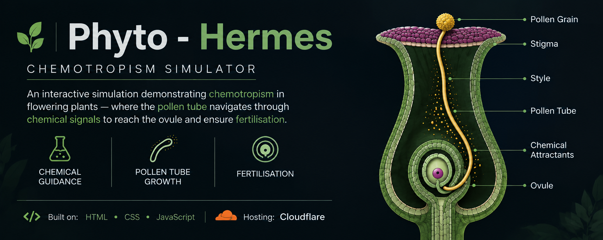

  

# 🧪 Phyto – Hermes

### *Interactive Chemotropism & Fertilization Simulator*

> **Phyto – Hermes** is an interactive visualization exploring **pollen tube chemotropic guidance, angiosperm fertilization, and double fertilization**.
>
🌱 **Plant Reproduction** · 🧬 **Chemotropism** · 🌸 **Double Fertilization**

**🔬 [Explore the Simulation](https://phyto-hermes.dray-ashcroft.workers.dev/)**

---

## ✦ Features

**🌱 Pollen Germination**  
Observe pollen germination and pollen tube initiation on the stigma.

**🧭 Chemotropic Guidance**  
Visualize pollen tube growth directed by chemical attractants from the ovule.

**🎮 Interactive Controls**  
Progress through pollen tube growth and fertilization stages.

**🧬 Double Fertilization**  
Observe the delivery of two male gametes into the embryo sac.

**🔬 Scientific Visualization**  
Explore pollen tube guidance and fertilization through interactive visualization.

**↻ Reset Functionality**  
Restart the simulation to explore the process again.

---

## 🧬 Core Concepts

**Chemotropism · Pollen Tube Growth · Ovule Guidance · Angiosperm Fertilization · Double Fertilization · Embryo Sac**

---

## ⚙️ Technology

**HTML · CSS · JavaScript**

**Repository:** GitHub & Codeberg  
**Hosting:** GitHub Pages

---

## 📜 License

Distributed under the **GNU General Public License v3.0 (GPL-3.0)**.
